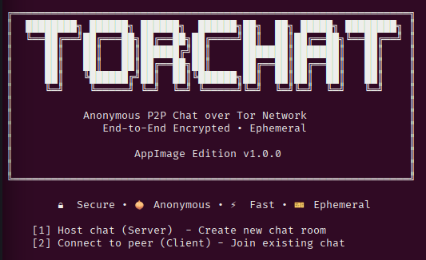
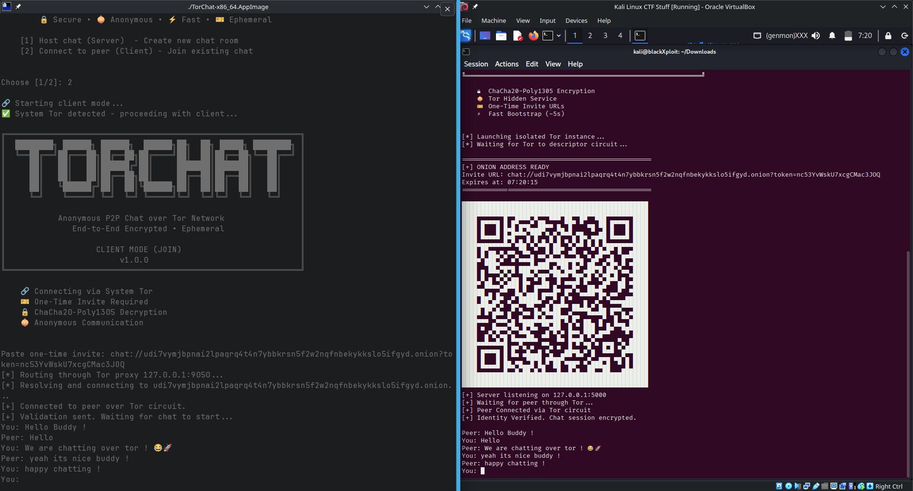
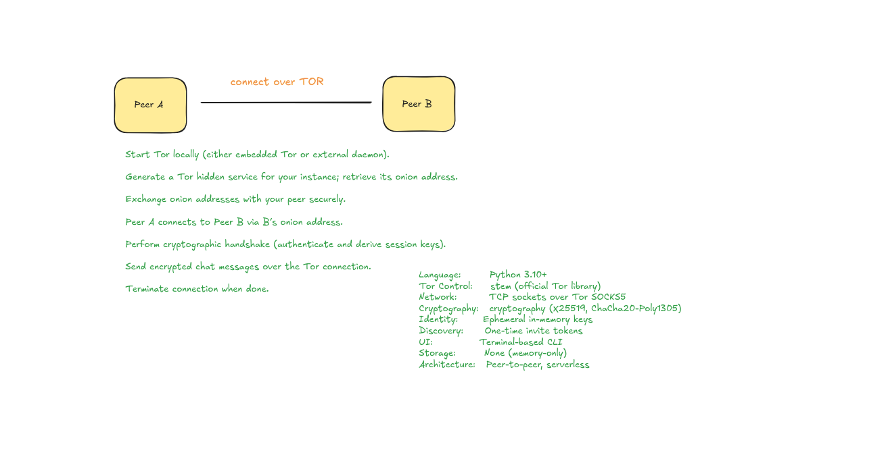

# TorChat - Anonymous P2P Chat

**Secure, private, and anonymous peer-to-peer chat over the Tor network**

# Basically 
### its a lightweight, privacy-first messaging tool that lets you communicate directly with others over the Tor network—without any central servers. It's designed for those who care deeply about privacy, security, and simplicity.

## What Makes TorChat Special

TorChat is really cool .
it has some cool stuffs that others dont have.

Unlike standard Tor chat systems that use permanent addresses, this implementation is entirely ephemeral.

    Zero Persistence: The server creates a temporary hidden service. Once the session ends, the .onion address is deleted and cannot be recovered or reused.

    Hybrid Architecture: I noticed that hosting a Tor service is usually the hardest part for users. To solve this, the Server mode uses an embedded Tor process that requires zero configuration. The Client mode simply hooks into the Tor instance you likely already have (like Tor Browser). means uses system tor.

    Simple Security: I chose ChaCha20-Poly1305 for encryption. It is faster than AES on most hardware and provides built-in authentication, meaning if a single bit of your message is tampered with during transit, the app rejects it.

yeah designed with 🔏.


## Features which currently available:

- **End-to-End Encryption**. The messages you send are locked with something called ChaCha20-Poly1305 before they even leave your device. This means your End-to-End Encryption keeps your messages safe.

Note : ChaCha20-Poly1305 is an authenticated encryption with associated data (AEAD) algorithm, that combines the ChaCha20 stream cipher with the Poly1305 message authentication code.[1] It has fast software performance, and without hardware acceleration, is usually faster than AES-GCM.[1]: §B 

source : https://en.wikipedia.org/wiki/ChaCha20-Poly1305
https://protonvpn.com/blog/chacha20

- **Automatic Setup**: You don't need to be a network expert. The server handles the Tor handshake and creates the secret .onion address for you automatically.

- **Self-Destructing Invites**: Invitations come with a built-in timer. The link only works for 10 minutes; if no one joins by then, the "door" locks for good.

- **QR Code Sharing**: Instead of typing a 56-character onion address (which is easy to mess up), the host can just show a QR code for the guest to scan.

- **Two-Way Talk( full-dumplex mode)**: Using Python threads, both people can type and receive messages at the same time without waiting for the other person to finish.

- **Total Erasure**: This tool is ephemeral. This means it leaves no footprints. There are no logs, no history, and no saved files. Once you close the chat, the address and the messages vanish as if they never existed.

## How to Run TorChat

### **Using AppImage**

TorChat uses a Tor architecture, for the best user experience:

#### ** Host a Chat session (Server Mode)**

-  **Zero Dependencies** - Uses embedded Tor

- **You can just run the AppImage**. There is no setup that you need to do for the AppImage.

```bash

./TorChat-x86_64.AppImage

# Choose: [1] Host chat (Server)

```

#### **Join a Chat session (Client Mode)**

-  **Requires Tor** - Uses system Tor or Tor Browser

- **Most people already have this thing** hope.

**Option A: Using Tor Browser (Easiest)**

```bash

# 1. First you need to open the Tor Browser because it gives you a SOCKS proxy that works on port 9150 which's the Tor Browser.

# 2. Run TorChat client

./TorChat-x86_64.AppImage

# Choose: [2] Connect to peer (Client)

```

**Option B: Using System Tor**

```bash

# 1. Install and start system Tor

sudo apt install tor [ debian ]
sudo pacman -S tor [ arch ]

To start the tor service you need to use the following command: 
sudo systemctl start tor.

This will get the tor service up and running. You have to use the tor service if you want to use tor. The command sudo 
systemctl start tor 
is what you should type to start tor.

# 2. Run TorChat client

./TorChat-x86_64.AppImage

# Choose: [2] Connect to peer (Client)

```

## Quick Start Example

**Person 1 (Host):**

```bash

chmod +x TorChat-x86_64.AppImage

./TorChat-x86_64.AppImage  # Choose [1] Server

# Share the invite URL/QR code

```

**Person 2 (Join):**

```bash

# Open Tor Browser first, then:

./TorChat-x86_64.AppImage  # Choose [2] Client

# Paste the invite URL

```

##  Development & Manual Installation

If you think you are cool dev then its for you.

### Prerequisites

- Python 3.7+ 

- System Tor (for client mode only)

### Setup

```bash

git clone https://github.com/blackXploit-404/torchat.git

cd torchat

python -m venv torchat

source torchat/bin/activate

pip install -r requirements.txt

```

### Run from Source

**Server (Host):**

```bash

python3 server.py

# This uses embedded Tor, so no setup is needed
```

**Client (Join):**

```bash

# Start system Tor first

python3 client.py
```
## Technical Details

Encryption Flow:

    A shared secret is hashed using SHA256 to create a 32-byte key.

    For every message, a random 12-byte nonce is generated.

    The message is encrypted, and the nonce is prepended to the data.

    The receiver peels off the first 12 bytes to use as the nonce for decryption.

Networking:

    Server: Binds to 127.0.0.1:5000, which Tor maps to a public .onion address.

    Client: Uses the SOCKS5 protocol to tunnel the TCP connection through the Tor circuit.

### Hybrid Tor Design

```

┌─────────────────┐    ┌─────────────────┐

│   SERVER MODE   │    │   CLIENT MODE   │

├─────────────────┤    ├─────────────────┤

│ Embedded Tor    │    │ System Tor      │

│ - Tor process   │◄──►│ - SOCKS proxy   │

│ - Hidden service│    │ - Port 9050/9150│

│ - No dependencies│   │ - Existing Tor  │

└─────────────────┘    └─────────────────┘

```


### Message Encryption Process

```

SENDER SIDE:

User Message: "Hello World"

│

▼

┌─────────────────────┐

│  ChaCha20-Poly1305  │

│  Encryption Engine  │

├─────────────────────┤

│ Key: SHA256(secret) │

│ Nonce: 12 random   │

│ Plaintext: message │

└─────────────────────┘

│

▼

Encrypted Bytes: [nonce + ciphertext + auth_tag]

│

▼

┌─────────────────────┐

│   Tor Network       │

│ (3-hop anonymity)   │

└─────────────────────┘

RECEIVER SIDE:

I got some encrypted bytes. These encrypted bytes were received. The encrypted bytes are now here.

│

▼

┌─────────────────────┐

│  ChaCha20-Poly1305  │

│  Decryption Engine  │

├─────────────────────┤

│ Key: SHA256(secret) │

│ Nonce: extract     │

│ Verify: auth_tag   │

└─────────────────────┘

│

▼

Decrypted Message: "Hello World"

```

### Tor Circuit Visualization

```

HOST                    TOR NETWORK                   CLIENT

┌─────────┐            ┌───┐    ┌───┐    ┌───┐         ┌─────────┐

│Embedded │───────────▶│ A │───▶│ B │───▶ │  C │◄─────│ System|│

│   Tor   │            │   │    │   │    │   │         │   Tor   │

└─────────┘            └───┘    └───┘    └───┘         └─────────┘

│                 Entry   Middle    Exit              │

│                 Node     Node     Node              │

▼                                                     ▼

.onion Address         3-Hop Encrypted Circuit        SOCKS5 Proxy


```

### Security Considerations:

- **-shared secret**. This method uses a password that is already set and it is okay to use for now.

- **No user authentication**. Anyone who gets the invite URL can join.

- **No message history**. The messages are not stored in any place. This means that when you send a message it is not kept anywhere. The messages are not saved so you will not be able to look at them later. This is how the system works with the messages. The messages are not kept in any storage they are just. Then they are gone.

- **Invite expiration** - Invites expire for security (10 minutes default) 


### Tor Configuration:

```

# Embedded Tor (Server)

DataDirectory /tmp/tor_chat_xyz/

HiddenServiceDir /tmp/tor_chat_xyz/hidden_service/

HiddenServicePort 5000 127.0.0.1:5000

SocksPort 0  # Disabled for server

# System Tor (Client)

SocksPort 9050

# Default system configuration


```

### Initial Plan 
now it has more features than this


## Legal & Ethical Use

TorChat is intended for lawful privacy-enhancing communication. Use responsibly and comply with local laws.

## 📄 License

This project is licensed under the MIT License. See [LICENSE](./LICENSE) for details.

##  Contributing
Want to make TorChat better? Contributions are welcome!

- Open an issue for bugs or ideas
- Submit pull requests with improvements
- Feel free to fork and remix the project

## Enjoy Anonymous Chatting!
